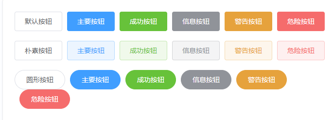

### 使用 vue-cli

我们还可以使用 [vue-cli](https://github.com/vuejs/vue-cli) 初始化项目，命令如下：

```shell
> npm i -g vue-cli
> mkdir my-project && cd my-project
> vue init webpack
> npm i && npm i element-ui
```


在 main.js 中写入以下内容：

```javascript
import Vue from 'vue'
import App from './App'
import router from './router'
import ElementUI from 'element-ui'
import 'element-ui/lib/theme-chalk/index.css'
import 'element-ui/lib/theme-chalk/display.css'
Vue.use(ElementUI)

Vue.config.productionTip = false

/* eslint-disable no-new */
new Vue({
  el: '#app',
  router,
  components: { App },
  template: '<App/>',
  render: h => h(App)
})
```

