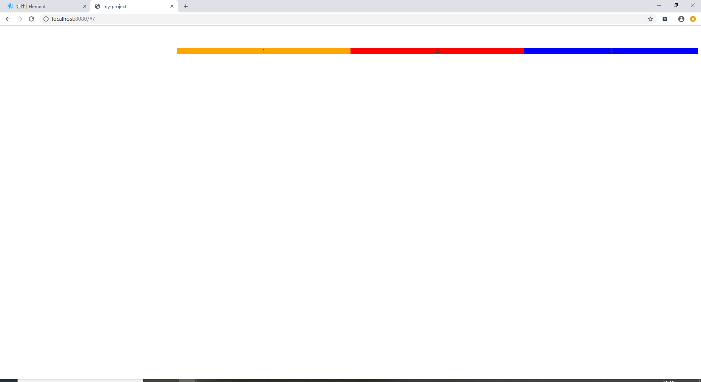

###  基础布局

##### 一行是24列 栅格布局(el-col :span="列宽值")：

```html
<el-row>
    <el-col :span="5">
        <div style="background-color:red">
            展示内容
        </div>
    </el-col>
    <el-col :span="6">
        <div style="background-color:blue">
            展示内容
        </div>
    </el-col>
</el-row>
```


##### 列之间的间隔(el-row :gutter="间隔值")

```html
<!-- 正确展示 -->

<el-row :gutter="30">
    <el-col :span="5">
        <div style="background-color:red">
            展示内容
        </div>
    </el-col>
    <el-col :span="6">
        <div style="background-color:blue">
            展示内容
        </div>
    </el-col>
</el-row>

```


##### 注意 当`<el-col></el-col>`标签里没有`<div></div>`标签时，他这个间隔会失效，结果把两列的宽变大 

```html
<!-- 错误展示 -->
<el-row :gutter="100">
    <el-col :span="6" style="background-color:red">ads</el-col>
    <el-col :span="6" style="background-color:orange">adqqqs</el-col>
</el-row>
```


#### 列在一行中的对齐方式

- ##### 左对齐（原始效果）

```html
<!-- 左对齐（原始效果） -->
<el-row type="flex">
  <el-col :span="6"><div style="background-color:orange">1</div></el-col>
  <el-col :span="6"><div style="background-color:blue">2</div></el-col>
  <el-col :span="6"><div style="background-color:red">3</div></el-col>
</el-row>
```


- ##### 居中对齐

```html
<!-- 居中对齐 -->
<el-row type="flex" justify="center">
  <el-col :span="6"><div style="background-color:orange">1</div></el-col>
  <el-col :span="6"><div style="background-color:blue">2</div></el-col>
  <el-col :span="6"><div style="background-color:red">3</div></el-col>
</el-row>
```


- ##### 右对齐

```html
<!-- 右对齐 -->
<el-row type="flex" justify="end">
  <el-col :span="6"><div style="background-color:orange">1</div></el-col>
  <el-col :span="6"><div style="background-color:red">2</div></el-col>
  <el-col :span="6"><div style="background-color:blue">3</div></el-col>
</el-row>
```




- ##### 空白两边没有

```html
<el-row type="flex"  justify="space-between">
  <el-col :span="6"><div style="background-color:blue">1</div></el-col>
  <el-col :span="6"><div style="background-color:red">2</div></el-col>
  <el-col :span="6"><div style="background-color:orange">3</div></el-col>
</el-row>
```


- ##### 空白环绕盒子（div）

```html
<el-row type="flex" justify="space-around">
  <el-col :span="6"><div style="background-color:blue">1</div></el-col>
  <el-col :span="6"><div style="background-color:red">2</div></el-col>
  <el-col :span="6"><div style="background-color:orange">3</div></el-col>
</el-row>
```


### 分栏偏移

##### 支持偏移指定的栏数（ 通过制定 col 组件的 `offset` 属性可以指定分栏偏移的栏数 ）

```html
<el-row :gutter="20">
  <el-col :span="6"><div class="grid-content bg-purple"></div></el-col>
  <el-col :span="6" :offset="6"><div class="grid-content bg-purple"></div></el-col>
</el-row>
<el-row :gutter="20">
  <el-col :span="6" :offset="6"><div class="grid-content bg-purple"></div></el-col>
  <el-col :span="6" :offset="6"><div class="grid-content bg-purple"></div></el-col>
</el-row>
<el-row :gutter="20">
  <el-col :span="12" :offset="6"><div class="grid-content bg-purple"></div></el-col>
</el-row>

<style>
  .el-row {
    margin-bottom: 20px;
    &:last-child {
      margin-bottom: 0;
    }
  }
  .el-col {
    border-radius: 4px;
  }
  .bg-purple-dark {
    background: #99a9bf;
  }
  .bg-purple {
    background: #d3dce6;
  }
  .bg-purple-light {
    background: #e5e9f2;
  }
  .grid-content {
    border-radius: 4px;
    min-height: 36px;
  }
  .row-bg {
    padding: 10px 0;
    background-color: #f9fafc;
  }
</style>
```


### 响应式布局

参照了 Bootstrap 的 响应式设计，预设了五个响应尺寸：`xs`、`sm`、`md`、`lg` 和 `xl`。

```html
<el-row :gutter="10">
  <el-col :xs="8" :sm="6" :md="4" :lg="3" :xl="1"><div class="grid-content bg-purple"></div></el-col>
  <el-col :xs="4" :sm="6" :md="8" :lg="9" :xl="11"><div class="grid-content bg-purple-light"></div></el-col>
  <el-col :xs="4" :sm="6" :md="8" :lg="9" :xl="11"><div class="grid-content bg-purple"></div></el-col>
  <el-col :xs="8" :sm="6" :md="4" :lg="3" :xl="1"><div class="grid-content bg-purple-light"></div></el-col>
</el-row>

<style>
  .el-col {
    border-radius: 4px;
  }
  .bg-purple-dark {
    background: #99a9bf;
  }
  .bg-purple {
    background: #d3dce6;
  }
  .bg-purple-light {
    background: #e5e9f2;
  }
  .grid-content {
    border-radius: 4px;
    min-height: 36px;
  }
</style>
```


### 基于断点的隐藏类

Element 额外提供了一系列类名，用于在某些条件下隐藏元素。这些类名可以添加在任何 DOM 元素或自定义组件上。如果需要，请自行引入以下文件：

```js
import 'element-ui/lib/theme-chalk/display.css';
```

包含的类名及其含义为：

- `hidden-xs-only` - 当视口在 `xs` 尺寸时隐藏
- `hidden-sm-only` - 当视口在 `sm` 尺寸时隐藏
- `hidden-sm-and-down` - 当视口在 `sm` 及以下尺寸时隐藏
- `hidden-sm-and-up` - 当视口在 `sm` 及以上尺寸时隐藏
- `hidden-md-only` - 当视口在 `md` 尺寸时隐藏
- `hidden-md-and-down` - 当视口在 `md` 及以下尺寸时隐藏
- `hidden-md-and-up` - 当视口在 `md` 及以上尺寸时隐藏
- `hidden-lg-only` - 当视口在 `lg` 尺寸时隐藏
- `hidden-lg-and-down` - 当视口在 `lg` 及以下尺寸时隐藏
- `hidden-lg-and-up` - 当视口在 `lg` 及以上尺寸时隐藏
- `hidden-xl-only` - 当视口在 `xl` 尺寸时隐藏