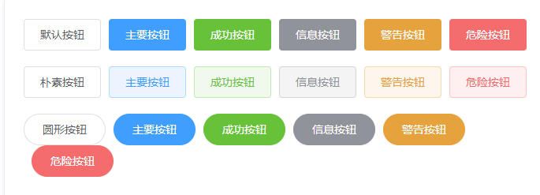

## Button 按钮

常用的操作按钮。

### [¶](https://element.eleme.cn/2.0/#/zh-CN/component/button#ji-chu-yong-fa)基础用法

基础的按钮用法。

使用`type`、`plain`和`round`属性来定义 Button 的样式。





```html
<div>
  <el-button>默认按钮</el-button>
  <el-button type="primary">主要按钮</el-button>
  <el-button type="success">成功按钮</el-button>
  <el-button type="info">信息按钮</el-button>
  <el-button type="warning">警告按钮</el-button>
  <el-button type="danger">危险按钮</el-button>
</div>

<div style="margin: 20px 0">
  <el-button plain>朴素按钮</el-button>
  <el-button type="primary" plain>主要按钮</el-button>
  <el-button type="success" plain>成功按钮</el-button>
  <el-button type="info" plain>信息按钮</el-button>
  <el-button type="warning" plain>警告按钮</el-button>
  <el-button type="danger" plain>危险按钮</el-button>
</div>

<div>
  <el-button round>圆形按钮</el-button>
  <el-button type="primary" round>主要按钮</el-button>
  <el-button type="success" round>成功按钮</el-button>
  <el-button type="info" round>信息按钮</el-button>
  <el-button type="warning" round>警告按钮</el-button>
  <el-button type="danger" round>危险按钮</el-button>
</div>
```

### [¶](https://element.eleme.cn/2.0/#/zh-CN/component/button#jin-yong-zhuang-tai)禁用状态

按钮不可用状态。

你可以使用`disabled`属性来定义按钮是否可用，它接受一个`Boolean`值。


```html
<div>
  <el-button disabled>默认按钮</el-button>
  <el-button type="primary" disabled>主要按钮</el-button>
  <el-button type="success" disabled>成功按钮</el-button>
  <el-button type="info" disabled>信息按钮</el-button>
  <el-button type="warning" disabled>警告按钮</el-button>
  <el-button type="danger" disabled>危险按钮</el-button>
</div>

<div style="margin-top: 20px">
  <el-button plain disabled>朴素按钮</el-button>
  <el-button type="primary" plain disabled>主要按钮</el-button>
  <el-button type="success" plain disabled>成功按钮</el-button>
  <el-button type="info" plain disabled>信息按钮</el-button>
  <el-button type="warning" plain disabled>警告按钮</el-button>
  <el-button type="danger" plain disabled>危险按钮</el-button>
</div>
```

### [¶](https://element.eleme.cn/2.0/#/zh-CN/component/button#wen-zi-an-niu)文字按钮

没有边框和背景色的按钮。


```html
<el-button type="text">文字按钮</el-button>
<el-button type="text" disabled>文字按钮</el-button>
```

### [¶](https://element.eleme.cn/2.0/#/zh-CN/component/button#tu-biao-an-niu)图标按钮

带图标的按钮可增强辨识度（有文字）或节省空间（无文字）。


设置`icon`属性即可，icon 的列表可以参考 Element 的 icon 组件，也可以设置在文字右边的 icon ，只要使用`i`标签即可，可以使用自定义图标。

```html
<el-button type="primary" icon="el-icon-edit"></el-button>
<el-button type="primary" icon="el-icon-share"></el-button>
<el-button type="primary" icon="el-icon-delete"></el-button>
<el-button type="primary" icon="el-icon-search">搜索</el-button>
<el-button type="primary">上传<i class="el-icon-upload el-icon--right"></i></el-button>
```

### [¶](https://element.eleme.cn/2.0/#/zh-CN/component/button#an-niu-zu)按钮组

以按钮组的方式出现，常用于多项类似操作。


```html
<el-button-group>
  <el-button type="primary" icon="el-icon-arrow-left">上一页</el-button>
  <el-button type="primary">下一页<i class="el-icon-arrow-right el-icon--right"></i></el-button>
</el-button-group>
<el-button-group>
  <el-button type="primary" icon="el-icon-edit"></el-button>
  <el-button type="primary" icon="el-icon-share"></el-button>
  <el-button type="primary" icon="el-icon-delete"></el-button>
</el-button-group>
```

### [¶](https://element.eleme.cn/2.0/#/zh-CN/component/button#jia-zai-zhong)加载中

点击按钮后进行数据加载操作，在按钮上显示加载状态。

要设置为 loading 状态，只要设置`loading`属性为`true`即可。


```html
<el-button type="primary" :loading="true">加载中</el-button>
```

### [¶](https://element.eleme.cn/2.0/#/zh-CN/component/button#bu-tong-chi-cun)不同尺寸

Button 组件提供除了默认值以外的三种尺寸，可以在不同场景下选择合适的按钮尺寸。

额外的尺寸：`medium`、`small`、`mini`，通过设置`size`属性来配置它们。


```html
<div>
  <el-button>默认按钮</el-button>
  <el-button size="medium">中等按钮</el-button>
  <el-button size="small">小型按钮</el-button>
  <el-button size="mini">超小按钮</el-button>
</div>
<div style="margin-top: 20px">
  <el-button round>默认按钮</el-button>
  <el-button size="medium" round>中等按钮</el-button>
  <el-button size="small" round>小型按钮</el-button>
  <el-button size="mini" round>超小按钮</el-button>
</div>
```

### [¶](https://element.eleme.cn/2.0/#/zh-CN/component/button#attributes)Attributes

| 参数        | 说明           | 类型    | 可选值                                             | 默认值 |
| :---------- | :------------- | :------ | :------------------------------------------------- | :----- |
| size        | 尺寸           | string  | medium / small / mini                              | —      |
| type        | 类型           | string  | primary / success / warning / danger / info / text | —      |
| plain       | 是否朴素按钮   | boolean | —                                                  | false  |
| round       | 是否圆形按钮   | boolean | —                                                  | false  |
| loading     | 是否加载中状态 | boolean | —                                                  | false  |
| disabled    | 是否禁用状态   | boolean | —                                                  | false  |
| icon        | 图标类名       | string  | —                                                  | —      |
| autofocus   | 是否默认聚焦   | boolean | —                                                  | false  |
| native-type | 原生 type 属性 | string  | button / submit / reset                            | button |

